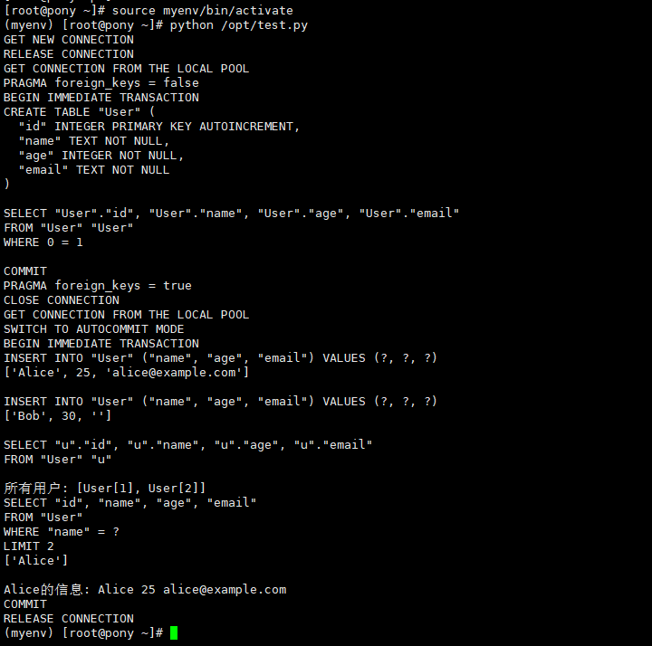

# pony对象关系映射器使用指南

# 一、商品链接

[pony对象关系映射器](https://marketplace.huaweicloud.com/hidden/contents/8790f1dc-508d-4ad8-b793-b19518550dad#productid=OFFI1166671996658528256)

# 二、商品说明

Pony 是一个高级对象相关的映射器。pony最有趣的功能是它可以使用Python Generator Expressions和Lambdas编写查询数据库的能力。
# 三、商品购买

您可以在云商店搜索 **pony对象关系映射器**。

其中，地域、规格、推荐配置使用默认，购买方式根据您的需求选择按需/按月/按年，短期使用推荐按需，长期使用推荐按月/按年，确认配置后点击“立即购买”。

# 3.1ECS 控制台配置

### 准备工作

在使用ECS控制台配置前，需要您提前配置好 **安全组规则**。

> **安全组规则的配置如下：**
> - 入方向规则放通 CloudShell 连接实例使用的端口 `22`，以便在控制台登录调试
> - 出方向规则一键放通

### 创建ECS

前提工作准备好后，选择 ECS 控制台配置跳转到[购买ECS](https://support.huaweicloud.com/qs-ecs/ecs_01_0103.html) 页面，ECS 资源的配置如下图所示：

选择CPU架构

选择服务器规格

选择镜像

其他参数根据实际请客进行填写，填写完成之后，点击立即购买即可


> **值得注意的是：**
> - VPC 您可以自行创建
> - 安全组选择 [**准备工作**](#准备工作) 中配置的安全组；
> - 弹性公网IP选择现在购买，推荐选择“按流量计费”，带宽大小可设置为5Mbit/s；
> - 高级配置需要在高级选项支持注入自定义数据，所以登录凭证不能选择“密码”，选择创建后设置；
> - 其余默认或按规则填写即可。

# 商品使用

## python对象关系映射器使用

进入虚拟环境
```bash
source myenv/bin/activate
```
执行示例进行数据库操作验证
```bash
python /opt/test.py
```


### 参考文档
[python官网](https://docs.ponyorm.org/)
